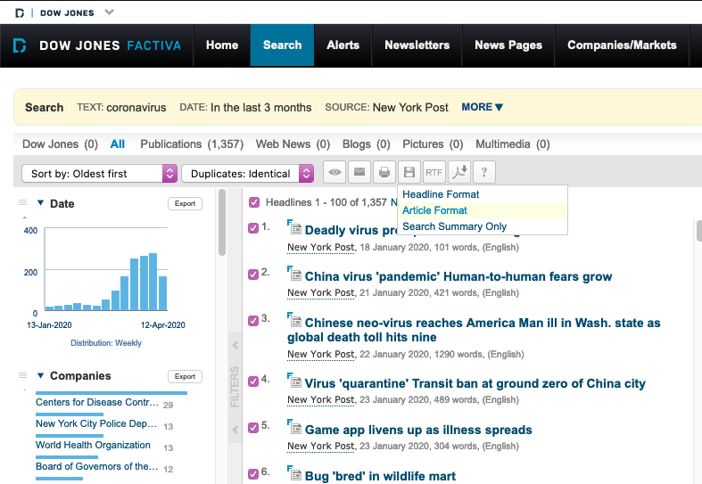
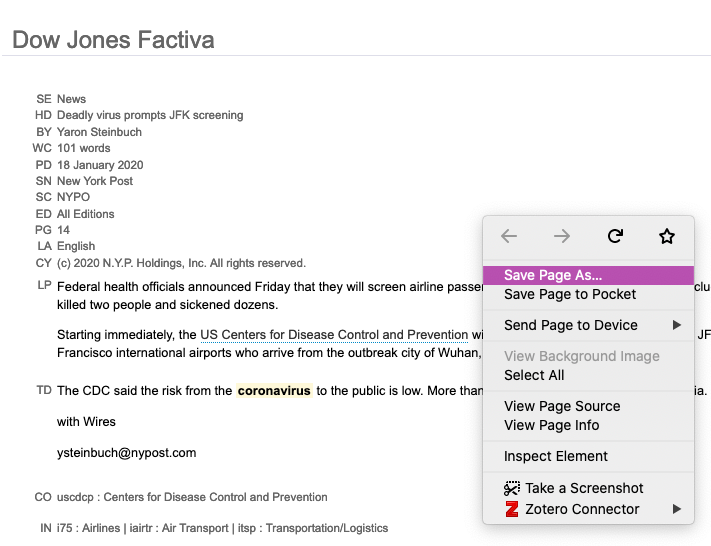

<!-- README.md is generated from README.Rmd. Please edit that file -->

# avitcaf

<!-- badges: start -->

<!-- badges: end -->

The goal of avitcaf is to extract news content from a wire service (that
I can’t even name it here).

## Installation

``` r
remotes::install_github("chainsawriot/avitcaf")
```

## Data collection

Please refer to the following two screenshots and use your imagination.





## Usage

``` r
avitcaf::avitcaf("nypost.html")
#> # A tibble: 100 x 5
#>    pubdate   headline             lede             body             source 
#>    <chr>     <chr>                <chr>            <chr>            <chr>  
#>  1 18 Janua… "Deadly virus promp… "Federal health… "The CDC said t… New Yo…
#>  2 21 Janua… "China virus 'pande… "China on Monda… "The infection … New Yo…
#>  3 22 Janua… "Chinese neo-virus … "The new virus … "The unidentifi… New Yo…
#>  4 23 Janua… "Virus 'quarantine'… "The Chinese ci… "Buses, subways… New Yo…
#>  5 23 Janua… "Game app livens up… "Chinese gamers… "Developed by U… New Yo…
#>  6 24 Janua… "Bug 'bred' in wild… "Chinese health… "\"Freshly slau… New Yo…
#>  7 24 Janua… "US patient might h… "The lone Ameri… "He had been ho… New Yo…
#>  8 24 Janua… "Queasy Huawei\r\n"  "Telecom giant … "The conference… New Yo…
#>  9 24 Janua… "Eerie parallels to… "The coronaviru… "The flick's en… New Yo…
#> 10 24 Janua… "'A state of war' v… "The Chinese ci… "Public-health … New Yo…
#> # … with 90 more rows
```

Multiple files? No problem, bring them on\!

``` r
avitcaf::avitcaf("nyt.html", "nypost.html")
#> # A tibble: 102 x 5
#>    pubdate   headline            lede             body             source  
#>    <chr>     <chr>               <chr>            <chr>            <chr>   
#>  1 29 July … "One Dead in Knife… "BERLIN -- A ma… "''What makes m… The New…
#>  2 30 July … "Suspect in Hambur… "BERLIN -- The … "''It remains u… The New…
#>  3 18 Janua… "Deadly virus prom… "Federal health… "The CDC said t… New Yor…
#>  4 21 Janua… "China virus 'pand… "China on Monda… "The infection … New Yor…
#>  5 22 Janua… "Chinese neo-virus… "The new virus … "The unidentifi… New Yor…
#>  6 23 Janua… "Virus 'quarantine… "The Chinese ci… "Buses, subways… New Yor…
#>  7 23 Janua… "Game app livens u… "Chinese gamers… "Developed by U… New Yor…
#>  8 24 Janua… "Bug 'bred' in wil… "Chinese health… "\"Freshly slau… New Yor…
#>  9 24 Janua… "US patient might … "The lone Ameri… "He had been ho… New Yor…
#> 10 24 Janua… "Queasy Huawei\r\n" "Telecom giant … "The conference… New Yor…
#> # … with 92 more rows
```

NOTE: For non-English articles, you need to change the `id` argument.
For example:

``` r
avitcaf::avitcaf("sz.html", id = "div.deArticle")
#> # A tibble: 100 x 5
#>    pubdate   headline            lede             body             source  
#>    <chr>     <chr>               <chr>            <chr>            <chr>   
#>  1 31 Decem… "EUROPA UND DIE WE… "Im Juli 2020 w… "„Europa“ ist e… Süddeut…
#>  2 31 Decem… "Aus Wind mach Gas… "Man stelle sic… "Dabei ist die … Süddeut…
#>  3 31 Decem… "Der Wald schwäche… "München - Wer … "So schlimm ste… Süddeut…
#>  4 31 Decem… "Die nächste grüne… "Im Streit um d… "All dies erfor… Süddeut…
#>  5 31 Decem… "Eine alte Vision;… "Wie visionär e… "30 Jahre ist d… Süddeut…
#>  6 31 Decem… "„Manche tun's hal… "Philosophen un… "Dieter Thomä: … Süddeut…
#>  7 31 Decem… "Grün, Blau und We… "Wenn man sich … "Die Stadt ist … Süddeut…
#>  8 31 Decem… "Wer nicht hüpft, … "Greta Thunberg… "Welt-Chefredak… Süddeut…
#>  9 31 Decem… "GERMANWINGS; Frus… "Ganz bestimmt … "Indes ist dies… Süddeut…
#> 10 31 Decem… "Dämmert's? An Sil… "Seit 2005 hält… "Für den 30. De… Süddeut…
#> # … with 90 more rows
```
